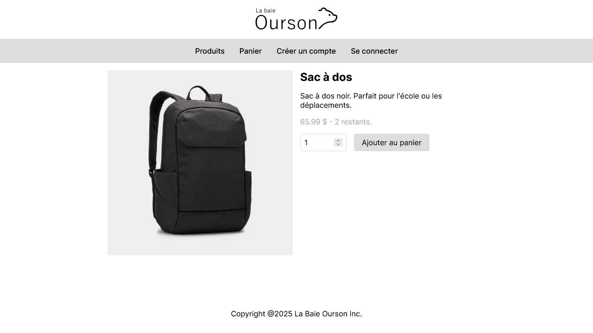
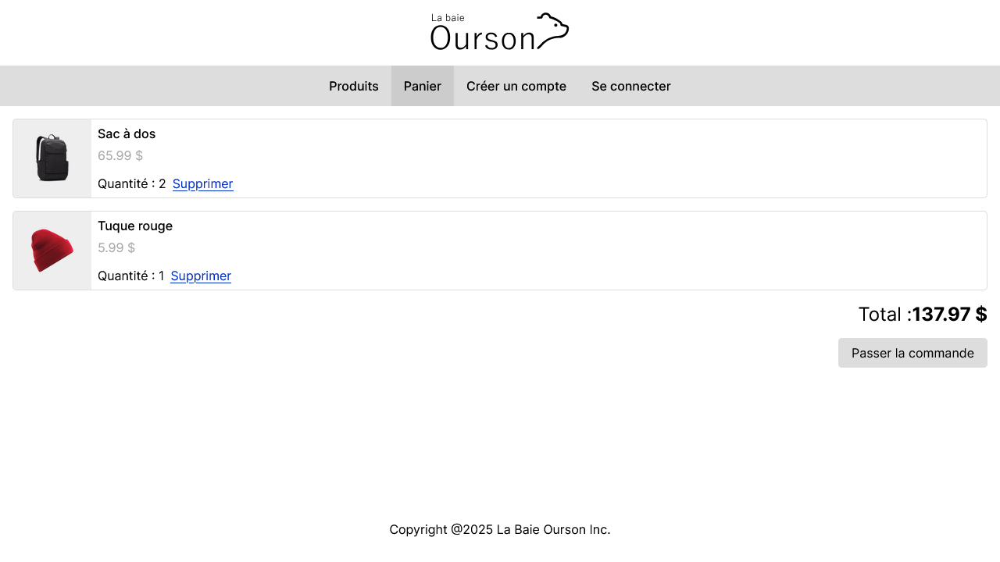

# Travail Pratique 2 - Magasin

Site web dynamique en PHP permettant d’acheter des produits. Le site doit montre
un catalogue de produits, le détail de chaque produit et leur inventaire. Il est
aussi possible de se créer un compte, de se connecter à son compte, de gérer un 
panier d’achats et passer à la caisse.

## Captures d'écran

## License

Copyright © 2025 Benjamin Lemelin